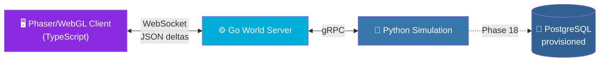
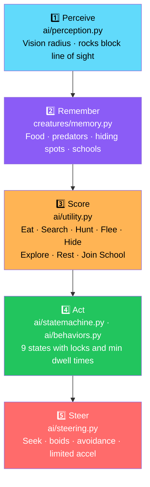
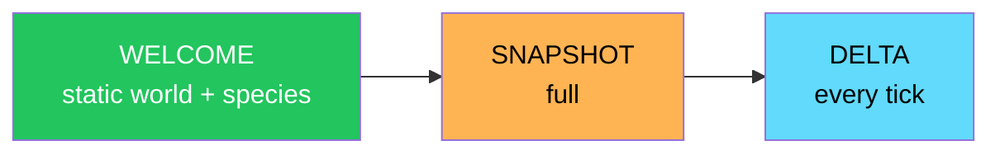

# 🐠 Aquarium Ecosystem

<div align="center">


**A living-ecosystem simulation, not an animation.**

*Every fish perceives, remembers, decides and acts on its own.*

[🚀 Run](#-run) • [✨ What Exists](#-what-exists) • [🧠 How a Fish Decides](#-how-a-fish-decides) • [📊 Performance](#-performance) • [⚠️ Known Limitations](#-known-limitations)

</div>

---

## 📖 Overview

**Aquarium Ecosystem** is a **living-ecosystem simulation, not an animation**.

Every fish **perceives, remembers, decides, and acts on its own**.

### 🎯 Scope

> **This drop covers Phases 1–5** *(rendering, movement, creature entities, needs, AI)* **as one vertical slice across all three services**, plus the parts of food, predation, and schooling that the AI needs to be demonstrable.

### Core Idea

> **No scripted behaviors. No canned animations.**
>
> Each fish runs perception, memory, utility scoring, a state machine, and steering — on its own schedule, from its own point of view.

### 🏗️ System Architecture



---

## 🚀 Run

### Docker *(Recommended)*

```bash
docker compose up          # http://localhost:3000
```

> 💡 **Builds run the Python tests; the Go build runs `go vet` + `go test`.**

### Without Docker

**Three terminals:**

```bash
make dev-sim      # terminal 1 — Python simulation
make dev-server   # terminal 2 — Go world server
make dev-client   # terminal 3 — client on :5173, proxies /ws
```

### 🐠 In the Tank

- **Click open water** to drop food
- **Click a fish** to inspect it
- **Add species** from the toolbar — try adding a **Reef Shark**
- **Debug toggles** — AI state labels, vision radius, selected target

---

## ✨ What Exists

<div align="center">

| Phase | Where | Notes |
|:-----:|-------|-------|
| **1** — Rendering | `client/src/{scenes,aquarium,rendering}` | Procedural textures, light shafts, sway, bubbles, motes. **Visual only.** |
| **2** — Movement | `simulation/ai/steering.py`, `client/src/networking/WorldState.ts` | Sim **20 Hz**, render **60 FPS** with interpolation **2 ticks behind**. |
| **3** — Entities | `simulation/creatures/` | Per-individual **genes, personality, traits, memory**. **4 species.** |
| **4** — Needs | `simulation/ai/needs.py` | Hunger, energy, health, safety, social. **Starvation is real.** |
| **5** — AI | `simulation/ai/` | Perceive → remember → score (utility) → FSM → steer. |

</div>

### ⚠️ Deliberately Not Built Yet

> **These need their own phases, and are not faked:**

| Area | Status |
|------|:------:|
| Water chemistry | ⏭️ Phase TBD |
| Plants as living things | ⏭️ Phase TBD |
| Breeding / genetics inheritance | ⏭️ Phase 12 |
| Disease | ⏭️ Phase TBD |
| Life cycle | ⏭️ Phase TBD |
| Building | ⏭️ Phase TBD |
| Auth | ⏭️ Phase TBD |
| Persistence | ⏭️ Phase 18 |
| Multiplayer | ⏭️ Phase TBD |
| Trading | ⏭️ Phase TBD |
| Achievements | ⏭️ Phase TBD |
| Analytics | ⏭️ Phase TBD |
| Audio | ⏭️ Phase TBD |
| Interest management | ⏭️ Phases 19–24 |

> 💡 **Food, predation, and schooling exist in basic form** — because the AI cannot be shown without them. **Phases 6–8 deepen them.**

---

## 🧠 How a Fish Decides

> **Runs on a schedule** — every 5 ticks, every 2 while fleeing / hunting / eating — **never per frame**.
>
> **Steering runs every tick.**



### 1️⃣ Perceive

**`ai/perception.py`**

- Only things inside the creature's **own vision radius**
- **Rocks block line of sight**

### 2️⃣ Remember

**`creatures/memory.py`**

- **Food spots**
- **Predator sightings**
- **Safe hiding spots**
- **School locations**

Memory is:

- **Decaying**
- **Merged**
- **Capacity-limited by intelligence**

> 💡 **Remembered food guides search; a visited-but-empty spot is forgotten.**

### 3️⃣ Score

**`ai/utility.py`**

Each action gets a **0–1.3 score** from **needs × personality × percepts**, with **hysteresis**:

- Eat
- Search
- Hunt
- Flee
- Hide
- Explore
- Rest
- Join School

> 💡 **Hunger can outrank mild danger; severe danger always wins.**

### 4️⃣ Act

**`ai/statemachine.py`** · **`ai/behaviors.py`**

The goal maps to a **state** with **locks** and **minimum dwell times**:

| State | |
|-------|:---:|
| **IDLE** | |
| **SEARCHING_FOR_FOOD** | |
| **EATING** | |
| **RESTING** | |
| **EXPLORING** | |
| **FLEEING** | ⚠️ **Overrides** |
| **HIDING** | |
| **SOCIALIZING** | |
| **HUNTING** | |

### 5️⃣ Steer

**`ai/steering.py`**

- **Seek / arrive**
- **Boids** — separation, alignment, cohesion
- **Wall and rock avoidance**
- **Limited acceleration**

### 🎭 Personality Changes Behavior, Not Just Numbers

<div align="center">

| Personality | Behavior |
|-------------|----------|
| **Shy** | Flee earlier · hide more · wander near plants |
| **Brave** | Tolerate predators |
| **Aggressive** | Hunt harder |
| **Lazy** | Rest more |

</div>

> 💡 **The inspector's "AI decision" panel shows the live score of every action for the selected fish.**

---

## 📡 Protocol (Go ↔ Client)

### Server → Client



A **delta** carries only creatures whose **quantized state changed**:

- 0.5 px
- ~3°
- State
- Energy / hunger %

**Plus:**

- **Explicit removals**
- **Food changes**
- **Events**
- **Stats**

### Client → Server

| Message | Purpose |
|---------|---------|
| **`FEED {x}`** | Drop food at position |
| **`ADD_CREATURE {species,x,y}`** | Spawn a creature |
| **`INSPECT {id}`** | Inspect a creature |

> 🔐 **All are validated and rate-limited in Go and validated again in Python.**
>
> **Slow clients are dropped and resync on reconnect.**
>
> **Rooms with no viewers do not tick.**

---

## 📊 Performance

> **Single thread, this sandbox, 20 Hz budget = 50 ms/tick.**

| Creatures | ms/tick | Budget Used | AI Decisions/s |
|:---------:|--------:|:-----------:|---------------:|
| **100** | 2.6 | 5% | 564 |
| **500** | 28.7 | 57% | 2,868 |
| **1,000** | **55.8** | **112%** | 5,826 |

> ⚠️ **The 1,000-creature target is NOT yet met in pure Python.**

**Phase 24 plans:**

- **Vectorized steering**
- **Wider AI scheduling intervals by LOD**
- **Sharding worlds across processes**

**Reproduce with:** `make bench`

---

## 🧪 Tests and Verification

| Suite | Count | Status in the Environment This Was Built In |
|-------|:-----:|--------------------------------------------|
| **Python** (`make test-sim`) | **29** | ✅ **Run, all passing** |
| **Go** (`delta`, `world` rooms with a fake simulator) | **8** | 🟡 **Written, not run** — no Go toolchain in the build sandbox |
| **TypeScript client** | **0** | ❌ **Not compiled or run** — no npm/network; all 9 files only passed a syntax parse |
| **gRPC adapter, Dockerfiles, compose** | **—** | ❌ **Not run** — no grpcio, Docker, or network. The service logic beneath the adapter is tested. |

### What the Python Suite Covers

- Food seeking
- Predator avoidance
- Hiding
- Hunting
- Schooling
- Perception
- Memory
- Needs
- Determinism
- Service validation

### ⚠️ What This Means

> **Expect to fix some compile or type errors in the Go and TypeScript on first build.**
>
> **The Docker builds will tell you immediately** — `go vet`, `go test`, and `tsc --noEmit` are build steps.
>
> **Please report what they print.**

---

## 📝 Known Limitations

<div align="center">

| Limitation | Details |
|-----------|---------|
| **Inspector "Genetics" values** | Display-scaled gene multipliers — **real inheritance arrives in Phase 12** |
| **Predator balance** | Tetras mostly escape healthy oscars; exhausted fish get caught. **Tuning comes with Phase 7** |
| **JSON deltas** | ~60 bytes per moving creature — **binary encoding and interest management are Phases 19–24** |
| **No offline simulation** | Empty rooms simply pause. The `Step(n)` RPC already supports catch-up for Phase 18 |

</div>

---

## 🗺️ Roadmap

### ✅ Current — Phases 1–5

- [x] **Phase 1 — Rendering** — procedural textures, light shafts, sway, bubbles, motes
- [x] **Phase 2 — Movement** — 20 Hz sim, 60 FPS render, interpolation 2 ticks behind
- [x] **Phase 3 — Entities** — per-individual genes, personality, traits, memory; 4 species
- [x] **Phase 4 — Needs** — hunger, energy, health, safety, social; starvation is real
- [x] **Phase 5 — AI** — perceive → remember → score (utility) → FSM → steer
- [x] Basic food, predation, and schooling *(as needed to demonstrate AI)*
- [x] WebSocket protocol with JSON deltas
- [x] Client messages: `FEED`, `ADD_CREATURE`, `INSPECT`
- [x] Validation in both Go and Python
- [x] Rate limiting and slow-client handling
- [x] Empty-room pause
- [x] 29 Python tests passing
- [x] 8 Go tests written
- [x] Docker Compose setup
- [x] Benchmark harness (`make bench`)

### 🔜 Not Yet Built

- [ ] **Phases 6–8** — deepen food, predation, and schooling
- [ ] **Phase 7** — predator balance tuning
- [ ] **Phase 12** — breeding / genetics inheritance
- [ ] **Phase 18** — persistence, offline simulation catch-up
- [ ] **Phases 19–24** — binary encoding, interest management, vectorized steering, LOD-based AI scheduling, world sharding
- [ ] Water chemistry
- [ ] Plants as living things
- [ ] Disease
- [ ] Life cycle
- [ ] Building
- [ ] Auth
- [ ] Multiplayer
- [ ] Trading
- [ ] Achievements
- [ ] Analytics
- [ ] Audio

---

## 🤝 Contributing

Contributions are welcome. Please:

1. Fork the repository
2. **Keep the AI on a schedule** — decisions every N ticks, never per frame
3. **Keep perception individual** — vision radius per creature, line of sight respected
4. **Keep validation on both sides** — Go *and* Python
5. **Never fake a phase** — if it's not built, list it as not built
6. **Report test failures honestly** — the build sandbox couldn't run Go or TypeScript tests; the first real build will
7. Submit a Pull Request

### Guidelines

- **Never run steering per frame** unless you're also measuring the cost
- **Never trust client messages** — validate in Go, then validate again in Python
- **Never tick empty rooms** — pause is a feature
- **Never ship a fake test pass** — count and status must be honest
- **Never break determinism** in the Python simulation

---

## 📜 License

MIT — see [LICENSE](LICENSE) for details.

---

## 🙏 Acknowledgments

- **Phaser** — for making the tank look alive
- **Go** — for a world server that stays out of the way
- **Python** — for making utility-based AI readable
- **Every fish that ever made a decision you didn't expect** — this one's for you

---

<div align="center">

### 🐠 PERCEIVE. REMEMBER. DECIDE. ACT.

**A living-ecosystem simulation, not an animation.**

**Every fish perceives, remembers, decides, and acts on its own.**

<br>

⭐ If this ecosystem helped you, consider giving it a star.

<br>

[⬆ Back to Top](#-aquarium-ecosystem)

</div>
